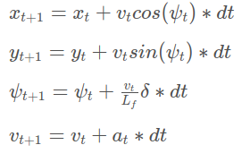
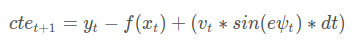
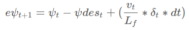

## Model Predictive Control (Self-Driving Car Engineer Nanodegree)

In this project, a MPC controller is utilized to control the steering angle and throttle of the car in the simulator.

This project involves the Udacity Self-Driving Car Engineer Nanodegree Term 2 Simulator which can be downloaded from [here](https://github.com/udacity/self-driving-car-sim/releases).


#### Dependencies

* cmake >= 3.5
* make >= 4.1 (Linux, Mac), 3.81 (Windows)
* gcc/g++ >= 5.4
* [uWebSocketIO](https://github.com/uWebSockets/uWebSockets) with commit hash e94b6e1
* [Ipopt](https://www.coin-or.org/download/source/Ipopt/); refer to [install_Ipopt_CppAD.md](https://github.com/udacity/CarND-MPC-Project/blob/master/install_Ipopt_CppAD.md) for details
* [CppAD](https://www.coin-or.org/CppAD/); refer to [install_Ipopt_CppAD.md](https://github.com/udacity/CarND-MPC-Project/blob/master/install_Ipopt_CppAD.md) for details


#### Build
The MPC controller program can be built and run by doing the following from the project top directory.

```bash
$> mkdir build
$> cd build
$> cmake ..
$> make
```


#### Run
Run from the project top directory.
```bash
$> build/mpc
```


#### Demo


[](https://youtu.be/abXEty-EF6U)


#### Description


##### Model
The MPC controller uses the kinematic model which can be described with formulas as follows.
  
  
  
`x` and `y` are vehicle coordinates, `psi` is the vehicle's orientation angle, and `v` is the vehicle's velocity magnitude. `cte` and `epsi` are a cross track error and an orientation error correspondingly. This model is able to predict vehicle's state at the time step `t+1` using the the information about the vehicle's state at the time step `t`. In these formulas, `delta` and `a` are actuators; the `delta` is the steering angle and the `a` is a single actuator representing the throttle and brackes. In this case (the Udacity simulator), the `delta` is in *[-25, 25]* and the `a` is in *[-1, 1]*. `Lf` measures the distance between the center of mass of the vehicle and it's front axle.


##### Timestep Length and Elapsed Duration 

In the [MPC.cpp](./src/MPC.cpp) you can find variables `N` and `dt`, timestep length and elapsed duration correspondigly. The initial values were `N=10` and `dt=0.1`, as suggested in the [recorded project Q&A](https://youtu.be/bOQuhpz3YfU) session. Then, during a process of the MPC parameter tuning, the values were changed to `N=7`, `dt=0.1`. Such a change of `N` helped to stabilaze the vehicle's trajectory and reduce oscilations. `N=6`, `N=8`, `N=9` values were also tried, but the car drives more unstable with these values. `dt` was left untouched, since the MPC needs to handle the 100ms delay, which is 0.1 of a second. In order to handle 100ms delay, actuations were applied with a shift of 1 elapsed duration, i.e., 100ms (see `FQ_eval::operator()` in [MPC.cpp](./src/MPC.cpp)). 


##### Polynomial Fitting and MPC Preprocessing

The waypoints were transformed to the vehicle's perspective, as suggested in the [recorded project Q&A](https://youtu.be/bOQuhpz3YfU) session. The vehicle's coordinates (`x`, `y`) and orientation angle `psi` transform to (0, 0) and 0, which simplifies the process to fit a polynomial to the waypoints and latter calculations.


##### Model Predictive Control with Latency

I first tried to run the MPC without the 100ms delay and with the parameters suggested in the [recorded project Q&A](https://youtu.be/bOQuhpz3YfU) session. It worked well and the car was able to drive the full lap. Then, I have added a 100ms delay and tried again---the car has left the drivable portion of the surface. For actuations, I applied a shift in time by `dt` as suggested in [link](https://github.com/jeremy-shannon/CarND-MPC-Project). The car was able to drive around the track with noticeable oscillations. I played with the weights which are part of the cost function and was able to drive a car relatively smooth at a speed between 30-35 mph. The next step was to increase the car's speed as much as possible on my Lenovo T430s with 16GB of RAM and Intel Core i5-3320M CPU. This took me 4 hours of fine-tuning. The significant milestone was the introduction of the penalty for simultaneous use of high values of `abs(delta)` and `abs(v)` (see `FQ_eval::operator()` in [MPC.cpp](./src/MPC.cpp)). This has helped me to get rid of the majority of oscillations while driving the straight line. Latter, I have added a penalty for simultaneous use of high values of `abs(delta)` and `abs(a)`, penalties for high velocity magnitude while having high `abs(cte)` and `abs(epsi)`. These penalties play a significant role in my MPC implementation. The change of any weight of these added cost function components leads to noticeable degradation of the MPC's performance---slower average velocity, more oscillations. While I finished to fine tune the majority of the weights, I increased the weight of the difference between the current velocity and reference velocity and also increased reference velocity to 120 mph. As a result, I have got an MPC controller that is able to drive a car around the track with an average speed of 65 mph (based on 2000 measurements and several laps), while reaching the speed of 98 mph on the straight portions of the track. The car behavior is adequate, it slows down before turns, speeds up on the straight portions of the track, just as a normal driver. For my relatively slow laptop it is a very good result, I believe.


#### Notice
For comprehensive instructions on how to install and run project, please, refer to the following repo, which was used as a skeleton for this project: https://github.com/udacity/CarND-MPC-Project.

