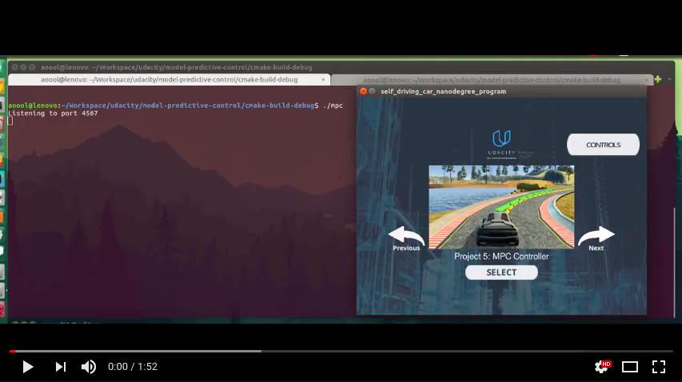

## Model Predictive Control (Self-Driving Car Engineer Nanodegree)

In this project, a MPC controller is utilized to control the steering angle and throttle of the car in the simulator.

This project involves the Udacity Self-Driving Car Engineer Nanodegree Term 2 Simulator which can be downloaded from [here](https://github.com/udacity/self-driving-car-sim/releases).


#### Dependencies

* cmake >= 3.5
* make >= 4.1 (Linux, Mac), 3.81 (Windows)
* gcc/g++ >= 5.4
* [uWebSocketIO](https://github.com/uWebSockets/uWebSockets) with commit hash e94b6e1
* [Ipopt](https://www.coin-or.org/download/source/Ipopt/); refer to [install_Ipopt_CppAD.md](https://github.com/udacity/CarND-MPC-Project/blob/master/install_Ipopt_CppAD.md) for details
* [CppAD](https://www.coin-or.org/CppAD/); refer to [install_Ipopt_CppAD.md](https://github.com/udacity/CarND-MPC-Project/blob/master/install_Ipopt_CppAD.md) for details


#### Build
The PID controller program can be built and run by doing the following from the project top directory.

```bash
$> mkdir build
$> cd build
$> cmake ..
$> make
```


#### Run
Run from the project top directory.
```bash
$> build/mpc
```


#### Demo


[](https://youtu.be/abXEty-EF6U)


